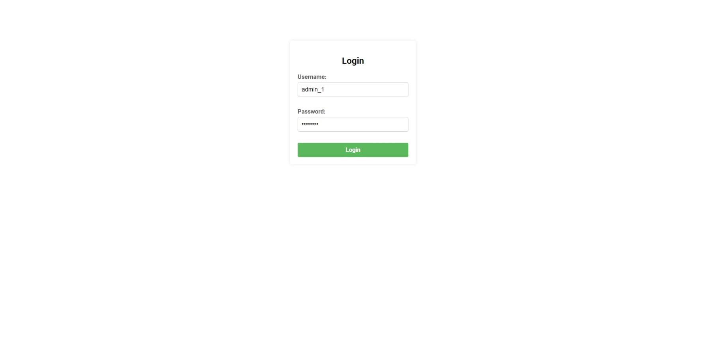
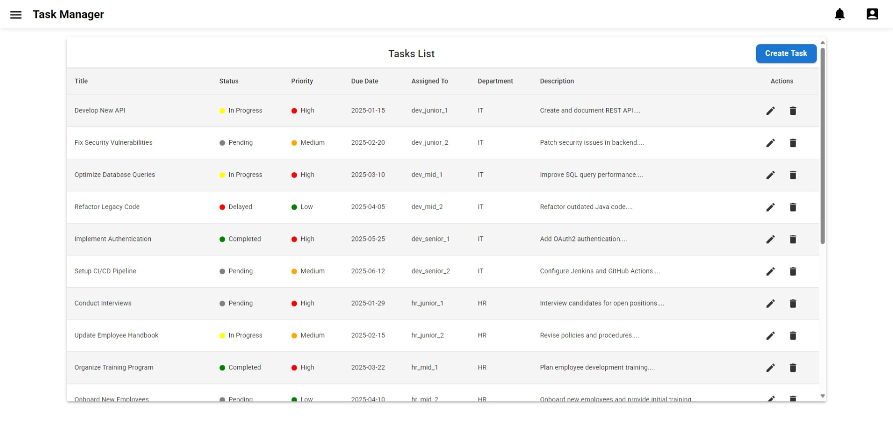
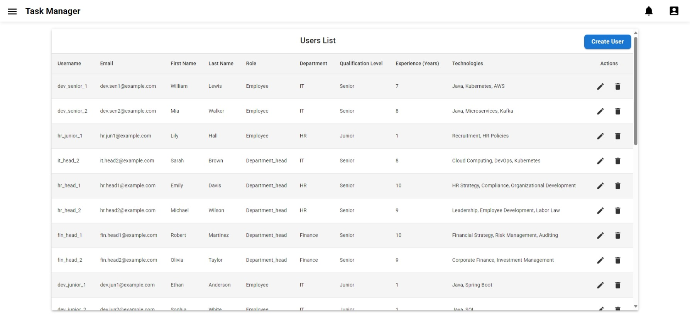
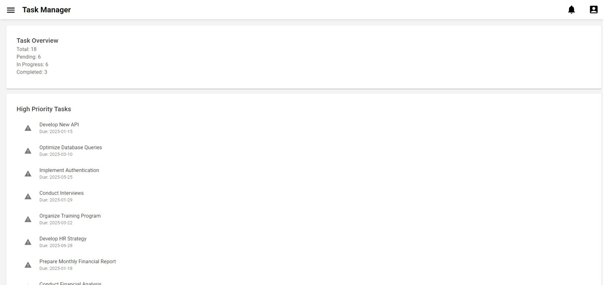

# Task Manager

## Description
This project is a task management system designed to help teams efficiently manage tasks, track progress, and improve overall productivity. The application supports multiple user roles with different access levels, allowing admins, department heads, and employees to interact with the system in different ways.

The core functionality revolves around tasks, which can be assigned, commented on, and updated by users. The system also allows notifications to be sent to users, providing real-time updates about task changes, user updates, and other activities within the app.

To ensure secure access and data protection, the application implements JWT-based authentication, requiring users to log in before accessing any functionality. Each user role has specific permissions, ensuring that employees can only access relevant information while admins have full control over the system.

## Database Tables

### `departments`
Stores company departments.  
**Columns**:
- `id`
- `name`

---

### `notification`
Stores notifications for users.  
**Columns**:
- `id`
- `message`
- `read`
- `user_id` (recipient)
- `timestamp` (notification time)
- `reference_id` (link to the entity that triggered the notification)
- `type` (TASK, USER, OTHER)

---

### `qualifications`
Stores user qualifications.  
**Columns**:
- `id`
- `experience_years`
- `technologies`
- `qualification` (JUNIOR, MID_LEVEL, SENIOR)

---

### `task_comments`
Stores comments related to tasks.  
**Columns**:
- `task_id`
- `id`
- `comment`
- `created_at`

---

### `tasks`
Stores information about tasks.  
**Columns**:
- `id`
- `title`
- `description`
- `priority` (LOW, MEDIUM, HIGH)
- `status` (PENDING, IN-PROGRESS, COMPLETED, DELAYED)
- `due_date`
- `assigned_to` (user ID)
- `created_at`
- `updated_at`
- `required_qualification` (JUNIOR, MID_LEVEL, SENIOR)
- `department_id` (department ID)

---

### `users`
Stores information about users.  
**Columns**:
- `id`
- `username` (unique)
- `password` (encoded in Jiviti)
- `email`
- `role` (EMPLOYEE, DEPARTMENT_HEAD, ADMIN)
- `first_name`
- `last_name`
- `created_at`
- `updated_at`
- `department_id` (user’s department)
- `qualification_id` (user’s qualification)
- `last_login`


## User Roles and Access

The application features different roles with varying access levels:

- **Admin**: Full access to manage all aspects of the application.
- **Department Head**: Can manage tasks and users within their department.
- **Employee**: Basic access to view their tasks.

## Access Credentials

You can use the following default credentials to log in and explore different roles:

- **Admin**:
  - Username: `admin_1`
  - Password: `12345678`

- **Department Head**:
  - Username: `it_head_1`
  - Password: `12345678`

- **Employee**:
  - Username: `dev_junior_1`
  - Password: `12345678`

## Project Structure
- `backend/` - Backend project with Spring Boot.
- `frontend/` - Frontend project with React.
- `db_dumps/` - SQL dumps for initializing the database.
- `docker-compose.yml` - Docker Compose file to build and run all services.

## Running the Project

To run the project locally, follow these steps:

1. Clone the repository:

    ```bash
    git clone --recurse-submodules <repository_URL>
    cd <project_folder>
    ```

2. Run Docker Compose:

    ```bash
    docker-compose up --build
    ```

   This will build and start containers for PostgreSQL, the backend, and the frontend.

3. Once everything is ready, the application will be available at:  
   - `http://localhost:3000` (Frontend)  

   To access the application, you need to log in at:  
   - `http://localhost:3000/login`  

   Without authentication, the application interface will not be visible due to security measures.

## Tech Stack

- **Backend**: Java, Spring Boot, PostgreSQL, JWT authentication.
- **Frontend**: React, HTML, CSS.
- **Database**: PostgreSQL.

## Screenshots

### Login Page


### Task Management Interface


### User Management Interface


### Dashboard Page


## Repository Links

- [Backend Repository](https://github.com/annasozonova/TaskManager-backend.git)
- [Frontend Repository](https://github.com/annasozonova/TaskManager-frontend.git)
